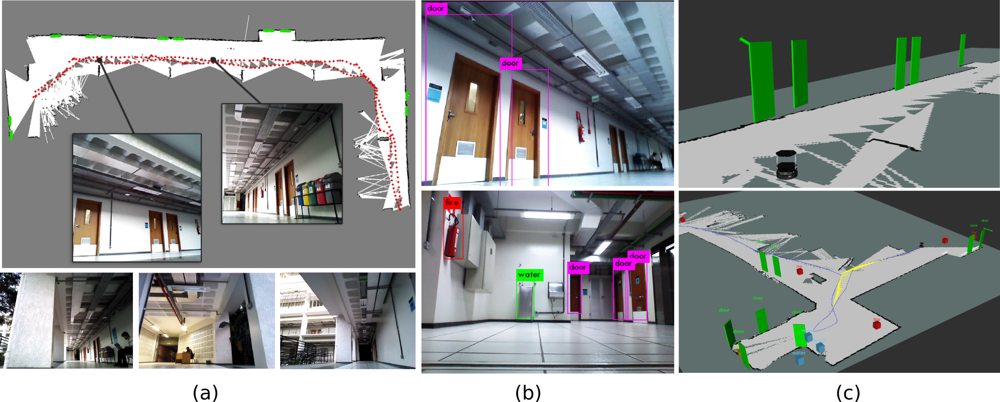

## <b>Extending Maps with Semantic and Contextual Object Information for Robot Navigation</b> <br>[[Project Page]](https://www.verlab.dcc.ufmg.br/semantic-mapping-for-robotics/) [[Paper arXiv]](https://arxiv.org/pdf/2003.06336.pdf)



This repository provides a code base to evaluate and test the semantic object mapping from the paper _Extending Maps with Semantic and Contextual Object Information for Robot Navigation_ [(arXiv version)](https://arxiv.org/pdf/2003.06336.pdf). The project core method is an object segmentation that leverages a CNN-based object detector (Yolo) with a 3D model-based segmentation technique (RANSAC) to perform instance semantic segmentation, and to localize, identify, and track different classes of objects in the scene over time. 

The package is implemented on ROS and we provide pretrained Yolo model weights and some ROS bags datasets for testing. Please follow the install and setup instructions to run the semantic object mapping system with a rosbag recorded data. This is research code, expect that it can change and any fitness for a particular purpose is disclaimed.

## Installation

The install steps were tested on ROS Kinetic and Ubuntu 16.04. The package requires ROS, Catkin and CUDNN properly installed. We divide instructions to meet these requirements in two parts, including some intermediate sanity check tips:

- ROS and Catkin workspace setup (if not set already): Please go to [INSTALL_ROS.md](docs/INSTALL_ROS.md) for detailed instructions.
- CUDA/CUDNN installation (if not set already): Please refer to [INSTALL_CUDNN.md](docs/INSTALL_CUDNN.md) for detailed instructions.

## Build Mapping Project

Once the package requirements are met, you can download and build the package uisng the following instructions:
```shell
cd ~/code/catkin_ws/src
git clone --recurse-submodules https://github.com/verlab/3d-object-semantic-mapping.git
```
Before compiling the project, you might need to change line 23 in file **"~/code/catkin_ws/src/darknet_ros/darknet_ros/CMakeLists.txt"** to assert the cuda compile version that is compatible to your graphics card version (please have a look at [INSTALL_CUDNN.md](docs/INSTALL_CUDNN.md)):
```shell
vim src/3d-object-semantic-mapping/darknet_ros/darknet_ros/CMakeLists.txt
```
And then build the packages in the following order:
```shell
cd ~/code/catkin_ws/
catkin config --default-devel-space --default-build-space --default-install-space --default-source-space --cmake-args -DCMAKE_BUILD_TYPE=Release
catkin build darknet_ros_msgs
catkin build custom_msgs
catkin build
source ~/.bashrc
```
## Getting Started: Package Testing

The provided code can run in two modes: offline and online. 

### Offline test, using pretrained weights and recorded robot data streams (dataset)

The package requires three terminal windows in order to run. In Terminal shell 1 start **darknet_ros** and **rviz**:
```shell
roslaunch auto quick_start.launch
```
In the second terminal, start the object localizer node:
```shell
roslaunch auto obj_positioner.launch
```
And then in the last terminal go to dataset folder and start playing the dataset bag with RATB-SLAM: 
```shell
roscd auto/../datasets/sequence3-kinect
./rtab-play.sh
```
## Customized configuration: running the package with your own bags and other network weights

In order to configure the stack to work on different datasets and classes, some configuration files need to be adjusted:

### Object detection configuration files

Configuration files related to darknet_ros and yolo detector itself. This includes the following: 

- `auto/launch/yolo_detector.launch` : Change the parameters file.
- `darknet_ros/darknet_ros/config` : Add the new parameters file for new network. Also, update `ros.yaml` topic names. 
- `darknet_ros/darknet_ros/yolo_network_config/cfg` : Add new network configuration file. 
- `darknet_ros/darknet_ros/yolo_network_config/weights` : Add new network weights.

### Object localization node configuration

Configuration files related to the 3D projector and the filter. This includes: 

- `auto/param/object_positioner.yaml` : Every node configuration for the object projection module is there, and it includes topic names, class detection list, frames of reference, camera parameters, etc. 

## Online test (using physical robot mounted with RGB-D camera)

Requirements: Kobuki base/other turtlebot base, RGBD camera, laser scan (optional) (RGBD camera depth stream can be converted to laser scan, but usually has lower range and accuracy).

Start robot base: 
```shell
roslaunch auto initialize.launch
```
And then run the slam and yolo_detector nodes as described in the offline test. 

**Notes**
*Before usage, check that no packages publish tf transformations, i.e., 'publish_tf' flag in launch files are set to* __false.__ *Only the rosbag play and robot description launch files should publish tf's.*

## Citation & Contact

If you find this code useful for your research, please consider citing the following papers:
```
    @article{semanticMapVerlab20,
	  Title          = {Extending Maps with Semantic and Contextual Object Information for Robot Navigation: a Learning-Based Framework using Visual and Depth Cues},
	  Author         = {Renato Martins and Dhiego Bersan and Mario F. M. Campos and Erickson R. Nascimento},
	  Booktitle      = {Journal of Intelligent and Robotic Systems},
	  Year           = {2020}
	}

    @inproceedings{semanticMapVerlab18,
	  Title          = {Semantic Map Augmentation for Robot Navigation: A Learning Approach based on Visual and Depth Data},
	  Author         = {Dhiego Bersan and Renato Martins and Mario F. M. Campos and Erickson R. Nascimento},
	  Booktitle      = {IEEE Latin American Robotics Symposium, LARS},
	  Year           = {2018}
	}
 ``` 
